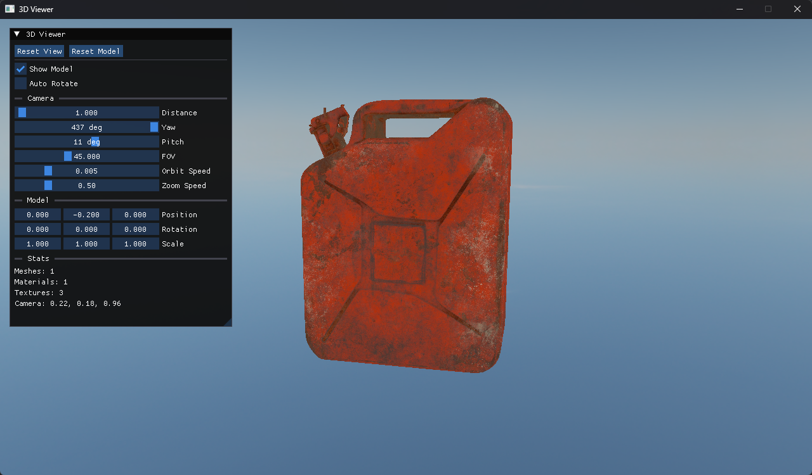

# Azer

一款轻量级、跨平台的 C++23 2D/3D 游戏引擎框架，基于**引擎即库**（engine-as-library）模式设计：`Azer` 编译为静态库，你的应用只需定义 `Azer::CreateApplication()` 并链接 `AzerCore`，即可获得窗口、Vulkan 渲染、节点场景树、动画等完整能力。窗口、输入与 Vulkan Surface 由 GLFW 驱动。

> 参考实现：[`SandBox/`](../SandBox) —— 一个可运行的最小示例工程，覆盖 Layer 生命周期、节点树、纹理绘制与 ImGui 面板，本文档中的示例代码均取自或简化自它。



## 目录

- [特性](#特性)
- [快速开始](#快速开始)
- [应用与 Layer](#应用与-layer)
- [节点系统](#节点系统)
- [渲染](#渲染)
- [资源与文件系统](#资源与文件系统)
- [目录结构](#目录结构)
- [依赖](#依赖)
- [常见问题](#常见问题)
- [许可证](#许可证)

## 特性

- **引擎即库** — 引擎本身不是可执行文件；应用只需实现 `Azer::CreateApplication()`，`EntryPoint.h` 提供 `main()`
- **Vulkan 渲染后端** — 完整 3D 管线（Swapchain、描述符管理、SPIR-V 反射、`vk_mem_alloc`），后端类型由 `RendererAPI::s_API` 统一管理
- **前端便利渲染器** — `Renderer2D` / `Renderer3D` 静态类，内置默认 shader 与单位网格，无需手动绑定管线
- **节点系统（Node）** — Godot 风格场景树：`Node` / `Node2D` / `Node3D` 与内置的 `Sprite2D`、`Button`，支持父子层级与生命周期回调传播
- **分层更新架构** — 确定性游戏循环：固定时间步物理 + 变帧率更新 + 物理插值平滑渲染
- **事件队列** — 窗口/键鼠事件先入队，再在帧内统一分发到 `Application` 与各 Layer，避免回调期间修改图层栈
- **依赖注入** — Layer 通过 `OnAttach(EngineContext&)` 获得 `Renderer&` 与 `Window&` 引用
- **Shader 资源系统** — `.azshader` 单文件嵌入顶点/片元 GLSL 与管线配置，运行时经 `glslc` 编译并缓存 `.spv`
- **资源与序列化** — glTF 模型加载（cgltf）、`SkyBox`、`SceneSerializer`、`AnimationPlayer`、反射式属性访问
- **平台** — 跨平台的 GLFW + Vulkan 架构；但当前 `vendor/glfw` 只提供了 **Windows 预编译库**（MSVC / MinGW），因此开箱即用的构建目标是 Windows

## 快速开始

### 环境要求

| 依赖 | 版本 | 说明 |
|------|------|------|
| CMake | 3.24+ | 工作区与引擎的最低版本要求 |
| C++ 编译器 | MSVC 或 MinGW-w64（GCC） | 需要 C++23；`vendor/glfw/CMakeLists.txt` 只为 MSVC 与 GNU 分支准备了预编译库，其它编译器会直接报错 |
| Vulkan SDK | 最新稳定版 | **硬性依赖**：链接 `Vulkan::Vulkan`，运行时调用 `$VULKAN_SDK/bin/glslc` 编译 shader |
| Python | 3.8+ | 可选，仅 `create_project.py` 需要 |

> GLFW、GLM、spdlog、ImGui、cgltf 等第三方库已随 `Azer-Core/vendor/` 一起提供，无需单独安装；其中 **GLM 与 spdlog 是 git 子模块**，若你通过 `git clone` 获取本仓库，需要先初始化它们：
>
> ```bash
> git submodule update --init --recursive
> ```
>
> （该命令需在 `Azer-Core/` 目录内执行。`Azer-Core/.gitmodules` 中仍残留已弃用的 `vendor/SDL`、`vendor/entt` 条目，不影响初始化，可清理。）

### 工作区结构

`Azer-Core` 需要与你的应用项目位于同一级目录：

```
AzerDev/                     # 工作区根目录
├── CMakeLists.txt           # 工作区入口：add_subdirectory(Azer-Core) / add_subdirectory(SandBox)
├── create_project.py        # 项目生成脚本
├── Azer-Core/               # 引擎（静态库）
└── SandBox/                 # 参考示例应用
```

### 1. 创建新项目

在工作区根目录执行（`<项目名>` 必须是合法的 C++ 标识符，如 `MyGame`）：

```bash
python create_project.py MyGame
```

脚本会：
- 创建 `MyGame/src/main.cpp`（含 `Azer::CreateApplication()` 的最小应用）
- 创建 `MyGame/CMakeLists.txt`（自动链接 `AzerCore`）
- 在工作区 `CMakeLists.txt` 中追加 `add_subdirectory(MyGame)`

若目标目录已存在，脚本会先询问是否覆盖。

### 2. 构建与运行

在工作区根目录执行：

```bash
cmake -B build
cmake --build build
```

生成的可执行文件名与项目名相同（如 `MyGame.exe` / `SandBox.exe`），位于 `build/` 下。

> 首次配置需要能找到 Vulkan SDK。若 CMake 报 `Could NOT find Vulkan`，请安装 Vulkan SDK、确认环境变量 `VULKAN_SDK` 已设置，然后删除 `build/` 重新配置。

### 3. Visual Studio

用 Visual Studio 直接打开**工作区根目录的 `CMakeLists.txt`**（VS 会自动识别为 CMake 工程）。在启动项下拉框中选择包含 `main.cpp` 的项目（如 `SandBox` 或 `MyGame`），按 F5 编译并运行。

> 若启动项列表中未出现目标项目，请先执行一次 CMake 重新配置（“项目 → 配置缓存”），或删除 `out/build` 后重新打开工程。

### 4. 运行参考示例

工作区内的 `SandBox` 就是可直接运行的示例：`SandBox/src/main.cpp` 定义应用并设置资源根路径，`SandBox/src/TestLayer.cpp` 演示了 Layer 生命周期与节点树的完整用法，建议作为上手起点。

## 应用与 Layer

### 应用入口

`EntryPoint.h` 提供 `main()`，应用只需实现工厂函数：

```cpp
#include "EntryPoint.h"
#include "Azer.h"

using namespace Azer;

class MyGame : public Application
{
public:
    MyGame() : Application("MyGame")
    {
        // 可选：把资源根路径切到应用自己的目录（详见「资源与文件系统」）
        // FileSystem::SetRootPath(FileSystem::ResolvePath("../MyGame"));

        PushLayer(new GameLayer());
    }
};

Azer::Application* Azer::CreateApplication()
{
    return new MyGame();
}
```

`Application` 构造时会自动完成：初始化 `FileSystem`（根路径 = `Azer-Core/`，由 CMake 注入编译期常量 `AZER_ASSET_ROOT`）、创建窗口（默认 1280×720）、创建 Vulkan 渲染器、初始化 `Renderer2D/3D`，并把内置 `ImGuiLayer` 压入图层栈。

常用接口：

| 接口 | 说明 |
|------|------|
| `PushLayer(Layer*)` / `PushOverlay(Layer*)` | 压入图层 / 覆盖层；普通图层插在覆盖层之前，因此覆盖层的绘制顺序在最后（`LayerStack` 用 `pos` 分隔两者） |
| `PopLayer()` / `PopOverlay()` | 弹出最上层图层 / 覆盖层，立即调用 `OnDetach()`，对象延迟到本帧末统一 `delete`（因此可在回调中安全调用） |
| `GetWindow()` / `GetRenderer()` | 访问窗口与后端渲染器 |
| `SetCoreMenuVisibility(bool)` | 显示/隐藏内置 “Azer Settings” 面板（默认显示） |
| `SetPhysicsHz(float)` | 设置固定物理步长频率（默认 60 Hz） |
| `Application::Get()` | 获取应用单例 |

### Layer 生命周期

Layer 是所有游戏逻辑的载体，回调顺序与 `Application::Run()` 的循环一一对应：

| 回调 | 调用时机 | 典型用途 |
|------|----------|----------|
| `OnAttach(EngineContext&)` | 被 `PushLayer` 时立即调用一次 | 加载资源、建树 |
| `OnEvent(Event&)` | 每帧开始阶段，事件队列中的事件依次分发 | 输入响应 |
| `OnPhysicsUpdate(float fixedDelta)` | 固定步长（默认 1/60 s），一帧内可能执行 0~N 次 | 确定性逻辑：移动、碰撞 |
| `OnUpdate(float delta)` | 每帧一次 | 变帧率逻辑：相机、动画 |
| `OnInterpolate(float alpha)` | 每帧一次，`alpha ∈ [0,1]` | 物理插值平滑渲染 |
| `OnImGuiRender()` | 每帧一次，处于 ImGui 帧内 | 调试面板 |
| `OnDraw()` | 每帧一次，处于 `BeginFrame` / `EndFrame` 之间 | 提交绘制 |
| `OnDetach()` | 图层被弹出或应用退出时 | 释放资源 |

> 窗口最小化时引擎会跳过整段 ImGui 与绘制流程：`OnUpdate` / `OnPhysicsUpdate` 仍会执行，`OnDraw` 不会。
> 需要在运行时移除图层时调用 `RequestRemove()`，引擎会在本帧绘制结束后安全卸载。

### 事件

`Application::Run()` 先收集 GLFW 事件入队，再在帧内统一分发。Layer 中按类型处理（`Azer.h` 只包含 `Event.h`，需要具体事件类时自行包含对应头文件）：

```cpp
#include "WindowEvent.h"   // WindowCloseEvent / WindowResizeEvent

void GameLayer::OnEvent(Event& event)
{
    Layer::OnEvent(event);

    if (event.GetEventType() == EventType::WindowResize)
    {
        auto& e = dynamic_cast<WindowResizeEvent&>(event);
        m_Camera.SetSize(e.GetWidth(), e.GetHeight());
    }

    m_Root->OnEvent(event);   // 转发给节点树（见「节点系统」）
}
```

| 头文件 | 事件类型（`GetEventType()`） | 事件类 | 携带数据 |
|--------|------------------------------|--------|----------|
| `WindowEvent.h` | `WindowClose` / `WindowResize` / `WindowFocus` / `WindowLostFocus` | `WindowCloseEvent`、`WindowResizeEvent` | `GetWidth()` / `GetHeight()` |
| `KeyEvent.h` | `KeyPressed` / `KeyReleased` | `KeyPressedEvent`、`KeyReleasedEvent` | `GetKeyCode()`、`IsRepeat()` |
| `MouseEvent.h` | `MouseMoved` / `MouseButtonPressed` / `MouseButtonReleased` | `MouseMoveEvent`、`MouseButtonPressedEvent`、`MouseButtonReleasedEvent` | `GetX()` / `GetY()`、`GetButton()` |

轮询式输入使用 `Input::IsKeyPressed(key)` 与 `Input::GetMousePosition()`。

### 已知限制

当前窗口标题固定为 `"Azer"`：`Application(windowTitle)` 的参数尚未接入 `Window::Create`，且 GLFW 后端中 `Window::SetTitle` / `SetResizable` / `SetWindowIcon` 仍是空实现。需要自定义时可在 `WindowsWindow` 中补上 `glfwSetWindowTitle` 等调用。

## 节点系统

节点系统是 Azer 推荐的**场景组织方式**，设计上参考 Godot：一切皆节点，节点可以挂载子节点形成一棵场景树，父节点的生命周期回调会自动向下传播。

### 类层次

```
Node                      # 基础节点：名字、UUID、子节点管理
├── Node2D                # 带 Transform2D（Position / Rotation / Scale）
│   ├── Sprite2D          # 绘制纹理
│   └── Button            # 绘制色块，响应悬停 / 按下
└── Node3D                # 带 Transform3D
```

`Node` 内部持有一个私有的 `NodeManager`（`resources/node/NodeManager.h`），负责子节点的存储与回调转发 —— 你不需要直接操作它，只需通过 `AddChild` / `GetChild` 组织层级。

### 生命周期回调

继承 `Node`（或 `Node2D` / `Node3D`）并重写以下虚函数：

| 回调 | 何时被调用 | 典型用途 |
|------|------------|----------|
| `Init()` | 手动调用 `root->Init()` 时，先父后子 | 分配资源、注册 |
| `Ready()` | 手动调用 `root->Ready()` 时 | 访问兄弟节点（此时整棵树已完成 `Init`） |
| `Process(float delta)` | 由 Layer 的 `OnUpdate` 驱动 | 变帧率逻辑 |
| `PhysicsProcess(float delta)` | 由 Layer 的 `OnPhysicsUpdate` 驱动 | 固定步长逻辑 |
| `OnEvent(Event&)` | 由 Layer 的 `OnEvent` 驱动 | 节点级输入响应 |
| `Draw()` | 由 Layer 的 `OnDraw` 驱动 | 提交绘制 |
| `Exit()` | 由 Layer 的 `OnDetach` 驱动 | 释放资源 |

**先调用基类实现，再写自己的逻辑**，回调才会继续传播给子节点：

```cpp
void Player::Process(float delta) override
{
    Node::Process(delta);   // 转发给子节点
    // ... 自己的逻辑
}
```

### 快速上手

节点树不会自动挂载，需要在 Layer 中显式驱动。流程是 **建树 → `Init()` / `Ready()` → 在各回调中转发**。

**第 1 步：定义自定义节点**

```cpp
#include "Azer.h"

using namespace Azer;

class Player : public Node2D
{
public:
    explicit Player(std::string name) : Node2D(std::move(name)) {}

    void Ready() override
    {
        Node::Ready();          // 先转发给子节点
        AZ_INFO("Player '{0}' ready", GetName());
    }

    void Process(float delta) override
    {
        Node::Process(delta);
        Transform.Position.x += 60.0f * delta;
    }

    void Draw() override
    {
        Node::Draw();
        Renderer2D::DrawColorQuad(Transform, { .r = 120, .g = 200, .b = 255, .a = 255 });
    }
};
```

**第 2 步：在 Layer 中建树并驱动**

```cpp
class GameLayer : public Layer
{
public:
    void OnAttach(EngineContext& ctx) override
    {
        Layer::OnAttach(ctx);

        m_Root = CreateRef<Node>("Root");     // 用普通 Node 作根：它的回调会完整传播

        // 精灵
        const Ref<Sprite2D> logo = CreateRef<Sprite2D>("Logo");
        logo->SetTexture(Texture::Create(FileSystem::ResolvePath("./assets/blue_hole.png")));
        logo->Transform.Scale = { 0.5f, 0.5f };
        m_Root->AddChild(logo);

        // 按钮
        const Ref<Button> button = CreateRef<Button>("StartButton");
        button->Transform.Position = { 0.0f, -220.0f };
        button->Transform.Scale = { 240.0f, 80.0f };
        m_Root->AddChild(button);

        // 自定义节点
        m_Root->AddChild(CreateRef<Player>("Player"));

        // 一次性初始化整棵树
        m_Root->Init();
        m_Root->Ready();
    }

    void OnUpdate(float delta) override        { m_Root->Process(delta); }
    void OnPhysicsUpdate(float fixedDelta) override { m_Root->PhysicsProcess(fixedDelta); }
    void OnEvent(Event& event) override        { m_Root->OnEvent(event); }
    void OnDetach() override                   { m_Root->Exit(); }

    void OnDraw() override
    {
        Renderer2D::SetCamera(m_Camera);
        m_Root->Draw();
    }

private:
    Ref<Node> m_Root;
    Camera2D m_Camera;
};
```

**第 3 步：在 ImGui 面板中取回节点实时调参**

```cpp
void GameLayer::OnImGuiRender()
{
    ImGui::Begin("Inspector");

    // GetChild 递归查找，可按名字取到任意深度的子节点
    if (const Ref<Node> node = m_Root->GetChild("Logo"))
    {
        auto& sprite = dynamic_cast<Sprite2D&>(*node);
        ImGui::SliderFloat2("Logo Scale", reinterpret_cast<float*>(&sprite.Transform.Scale), 0.1f, 4.0f);
    }

    ImGui::End();
}
```

### API 参考

`Node`（`resources/node/Node.h`）

| 成员 | 说明 |
|------|------|
| `explicit Node(std::string name)` | 构造节点并自动生成 UUID（无默认构造，必须传名字） |
| `GetName()` / `set_name(...)` | 读写节点名（`GetChild` 按名字查找） |
| `GetUUID()` | 节点唯一标识 |
| `AddChild(const Ref<Node>&)` | 追加子节点，由此组织层级 |
| `GetChild(const std::string& name)` | 递归查找子节点，未找到返回 `nullptr` |

`Node2D` / `Node3D`

| 成员 | 说明 |
|------|------|
| `Transform` | `Node2D` 为 `Transform2D{ Position, Rotation, Scale }`；`Node3D` 为 `Transform3D` |
| 构造 | 默认构造被 `= delete`，必须传入节点名 |

`Sprite2D`

| 成员 | 说明 |
|------|------|
| `SetTexture(const Ref<Texture>&)` | 设置纹理；为 `nullptr` 时本节点不产生任何绘制 |
| `Draw()` | 内部调用 `Renderer2D::DrawTexture`，使用自身 `Transform` |

`Button`

| 成员 | 说明 |
|------|------|
| `ButtonState` | `NORMAL` / `HOVER` / `ACTIVE` 三态，决定填充颜色 |
| `PhysicsProcess` | 依据鼠标位置刷新悬停状态 |
| `OnEvent` | 鼠标按下 → `ACTIVE`，抬起 → `NORMAL` |

### 注意事项与已知限制

- **`Node2D` / `Node3D` 把生命周期回调重写为空实现且不转发。** 因此以 `Node2D` 子类（`Button`、`Sprite2D`）作为父节点时，其子节点不会收到 `Init` / `Ready` / `Process` / `PhysicsProcess` / `OnEvent` / `Draw` / `Exit`。两种规避方式：把这类节点挂在普通 `Node` 根节点下（推荐，如示例），或在子类中显式调用 `Node::Xxx()` 完成转发。
- `GetChild` 只向下查找，**不包含自身**；跨分支查找请从根节点或公共祖先出发。
- 节点树没有脏标记或自动遍历：`Draw()` 必须由 Layer 在 `OnDraw` 中显式驱动，调用顺序即绘制顺序（先加入的子节点先绘制）。
- `Button` 的命中检测目前按 1280×720 视口、屏幕中心 `(640, 360)` 换算，窗口尺寸改变时需要相应调整。
- `Node` 以 `Ref`（`std::shared_ptr`）持有子节点，不存在循环引用；但 `NodeManager` 目前只提供 `add_node` / `get_node`，**从树中移除节点的能力需要自行扩展**。

## 渲染

### 渲染后端

| 枚举值 | 说明 |
|--------|------|
| `RendererAPI::API::None` | 未选择后端（默认零值）；`Renderer::Create()` 遇到它会直接断言，不可用 |
| `RendererAPI::API::Vulkan` | 默认，也是当前唯一可用的后端 |

早期基于 SDL_Renderer（`SDL_2D`）与 SDL_GPU 的后端已移除，2D/3D 绘制统一走 Vulkan。后端保存在静态成员 `RendererAPI::s_API` 中，初值即为 `Vulkan`；新增后端时需在 `Renderer::Create()` 的 `switch` 中补上分支。

### 便利渲染器

`Renderer2D`（`renderer/Renderer2D.h`）

| 接口 | 说明 |
|------|------|
| `SetCamera(Camera&)` | 设置相机，每帧绘制前调用一次 |
| `DrawQuad(transform, alpha)` | 用内置白色纹理绘制四边形 |
| `DrawColorQuad(transform, color)` | 绘制纯色四边形 |
| `DrawTexture(texture, transform, alpha)` | 绘制贴图四边形 |

`Renderer3D`（`renderer/Renderer3D.h`）

| 接口 | 说明 |
|------|------|
| `SetCamera(Camera&)` | 设置相机 |
| `DrawCube(transform)` | 用内置立方体网格与默认 base3d shader 绘制 |
| `DrawMesh(vbo, ibo, shader)` | 使用自定义缓冲与 shader 绘制 |
| `DrawSkybox(const Resources::SkyBox&)` | 绘制天空盒 |

两者都内置单位网格与默认 shader，无需手动创建管线；相机数据通过 `shader->SetUniform` 上传，绘制命令经 `RenderCommand` 提交给后端。

### Shader 资源系统

一个 `.azshader` 文件同时描述顶点/片元 GLSL 与管线状态，运行时由引擎调用 `glslc` 编译并缓存 `.spv`：

```
assets/shaders/
├── quad2d.azshader          # Renderer2D 默认 shader
├── base3d.azshader          # Renderer3D 默认 shader
├── skybox.azshader
└── quad2d/
    ├── quad2d.vert.glsl
    ├── quad2d.vert.spv      # 运行时生成的编译缓存
    ├── quad2d.frag.glsl
    └── quad2d.frag.spv
```

## 资源与文件系统

`FileSystem` 统一处理路径与读写，所有相对路径都相对“根路径”解析：

| 接口 | 说明 |
|------|------|
| `SetRootPath(path)` / `GetRootPath()` | 设置 / 获取资源根路径 |
| `ResolvePath(relative)` | 相对路径 → 绝对路径 |
| `ReadText` / `WriteText` / `ReadBytes` | 文本与二进制读写 |
| `Exists` / `IsDirectory` / `IsFile` | 路径判断 |
| `ListDirectory` / `ListDirectoryRecursive` | 目录遍历，返回 `FileEntry` 列表（可用于 Asset Browser） |
| `Join` / `GetExtension` / `GetFilename` / `GetFilenameNoExt` / `GetDirectory` | 路径工具 |

`Application` 构造时会把根路径设为 `Azer-Core/`（由 CMake 注入编译期常量 `AZER_ASSET_ROOT`，不含硬编码的绝对路径），因此引擎自带 shader 始终可被找到。

**应用若要加载自己的 `assets/`，需要在构造 `Application` 后把根路径切到应用目录：**

```cpp
MyGame() : Application("MyGame")
{
    FileSystem::SetRootPath(FileSystem::ResolvePath("../MyGame"));
    PushLayer(new GameLayer());
}
```

拿到路径后即可加载资源：

```cpp
const Ref<Texture> texture = Texture::Create(FileSystem::ResolvePath("./assets/blue_hole.png"));
const Scope<Model> model = Model::LoadGLTF(FileSystem::ResolvePath("./assets/model.glb"));
```

> 为避免绝对路径写死（换机器即失效），推荐用 `FileSystem::GetWorkingDirectory()`、`ResolvePath("../MyGame")` 或自行注入的编译期常量组合出应用目录。示例工程 `SandBox` 目前直接写死了绝对路径，仅作演示。

## 目录结构

```
Azer-Core/
├── CMakeLists.txt
├── create_project.py        # 项目生成脚本（历史副本，当前使用工作区根目录下的版本）
├── src/
│   ├── CMakeLists.txt       # 源文件清单 + include 目录 + AZER_ASSET_ROOT 注入
│   ├── Azer.h               # 伞头文件（包含全部公共 API）
│   ├── azpch.h              # 预编译头
│   ├── base/                # Application、Layer、LayerStack、ImGuiLayer、Logger、
│   │                        # Input、Window、Random、DeltaTime、GameObject/Scene/
│   │                        # SceneSerializer、Collision、Variant、UUID、Type
│   │   ├── animation/       # AnimationPlayer
│   │   ├── event/           # Event、KeyEvent、MouseEvent、WindowEvent
│   │   ├── file_system/     # FileSystem
│   │   └── reflection/      # PropertyAccessor
│   ├── renderer/            # Renderer、RendererAPI、Renderer2D/3D、RenderCommand、
│   │                        # Texture、Shader、Camera(2D/3D)、Mesh、Model、Material、Framebuffer
│   ├── resources/
│   │   ├── node/            # 节点系统：Node、Node2D、Node3D、NodeManager
│   │   │   └── node2d/      # Sprite2D、ui/Button
│   │   └── SkyBox.h/.cpp
│   └── backends/
│       ├── WindowsWindow/   # GLFW 窗口与输入回调
│       └── Vulkan/          # Vulkan 上下文、Swapchain、命令缓冲、渲染器与各类资源封装
├── vendor/                  # 第三方依赖（见下）
└── assets/
    ├── shaders/             # .azshader + 运行时编译缓存 .spv
    └── showcase/            # 文档截图
```

## 依赖

第三方库全部位于 `Azer-Core/vendor/`：

| 库 | 集成方式 | 用途 |
|----|----------|------|
| [GLFW](https://github.com/glfw/glfw) | 直接提交（Windows 预编译库） | 窗口、输入、Vulkan Surface |
| [GLM](https://github.com/g-truc/glm) | git 子模块 | 数学（向量、矩阵） |
| [spdlog](https://github.com/gabime/spdlog) | git 子模块 | 日志 |
| [Dear ImGui](https://github.com/ocornut/imgui) | 直接提交 | UI（编辑器、调试），含 GLFW + Vulkan 后端 |
| [cgltf](https://github.com/jkuhlmann/cgltf) | 直接提交 | glTF 模型加载 |
| [stb_image](https://github.com/nothings/stb) | 直接提交 | 图像加载 |
| [nlohmann_json](https://github.com/nlohmann/json) | 直接提交 | JSON 序列化 |
| [spirv_reflect](https://github.com/KhronosGroup/SPIRV-Reflect) | 直接提交 | SPIR-V 反射（Vulkan 管线推导） |
| [Vulkan SDK](https://vulkan.lunarg.com/) | 需自行安装 | Vulkan 运行时与 `glslc` 编译器 |

此外，Vulkan 显存分配使用 `vk_mem_alloc` 源码，位于 `src/backends/Vulkan/vk_mem_alloc.h`。

> 依赖清单与 `vendor/CMakeLists.txt` 一致：`vendor` 目标聚合了 Vulkan、GLFW、imgui、glm、spdlog、cgltf、stb_image、nlohmann_json 与 spirv_reflect，应用只需链接 `AzerCore`。
> 除 Vulkan SDK 外无需额外安装；`git clone` 得到的工作区记得先跑一次 `git submodule update --init --recursive`（GLM、spdlog）。

## 常见问题

**CMake 报 `Could NOT find Vulkan`**
安装 [Vulkan SDK](https://vulkan.lunarg.com/) 并确认环境变量 `VULKAN_SDK` 已设置，然后删除 `build/` 重新配置。

**运行时找不到 `glslc` / shader 编译失败**
引擎在运行时调用 `$VULKAN_SDK/bin/glslc` 编译 `assets/shaders/*.azshader`，请确认该可执行文件存在且可执行。

**窗口是黑的，什么都没画**
依次检查：`OnDraw` 中是否调用了 `Renderer2D::SetCamera`；节点树的 `Init()` / `Ready()` 是否执行过；`OnDraw` 是否真的调用了 `m_Root->Draw()`（引擎不会自动遍历节点树）。

**修改 `assets/shaders` 下的 GLSL 后没有生效**
`.spv` 是编译缓存，删除对应的 `.spv` 文件后重新运行即可强制重新编译。

**应用读不到自己的 `assets/`**
`FileSystem` 的根路径默认是 `Azer-Core/`，需要在应用构造中调用 `FileSystem::SetRootPath(...)` 切换（见「资源与文件系统」）。

**节点树的回调没有传播到子节点**
检查回调实现中是否调用了基类版本（`Node::Process(delta)` 等）；另外注意 `Node2D` / `Node3D` 的钩子是空实现，详见「节点系统 → 注意事项与已知限制」。

## 许可证

MIT 许可证 — 详见 [LICENSE](LICENSE)。
