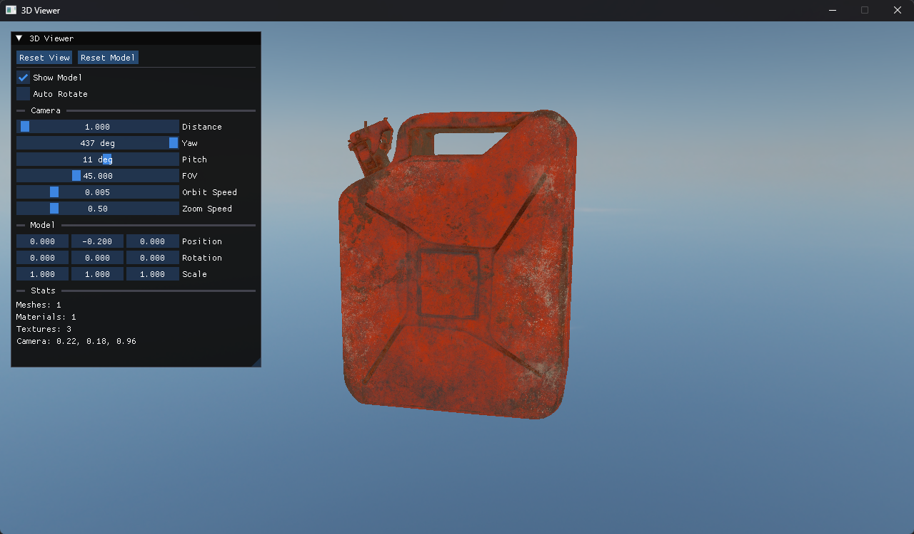

# Azer Engine

[English](README.md) | [中文](README_CH.md)

一款轻量级、跨平台的 C++23 2D/3D 游戏引擎框架。基于**引擎即库**（engine-as-a-library）模式设计：Azer 编译为静态/动态库，用户应用程序链接该库，支持可切换的渲染后端和分层更新架构——全部基于 SDL3 驱动。

## 展示

使用 Azer 构建的应用：


*3D 模型查看器 — 使用 `Azer` 引擎的 `ForwardPlus` GPU 后端构建*

## 特性

- **跨平台** — 通过 SDL3 支持 Windows、Linux、macOS
- **引擎即库** — 非可执行文件；用户定义 `CreateApplication()`，链接 `Azer`
- **可切换的渲染后端**
  - `Simple2D` — 基于 SDL_Renderer，适合 2D 应用
  - `ForwardPlus` — 基于 SDL GPU API，适合复杂 2D/3D 渲染
- **分层架构** — Layer 基类，生命周期：`OnAttach` → `OnPhysicsUpdate(fixedDt)` → `OnUpdate(dt)` → `OnInterpolate(alpha)` → `OnDraw` → `OnImGuiRender` → `OnDetach`
- **固定时间步物理** — 可配置步进频率（`SetPhysicsHz`），累加器驱动，带插值实现平滑渲染
- **依赖注入** — 无全局单例；Layer 通过 `OnAttach` 接收 `EngineContext{ Renderer&, Window& }`
- **类型化事件系统** — SDL 事件 → 类型化事件转换，通过 `EventDispatcher` 分发
- **Dear ImGui 集成** — 内置 `ImGuiLayer`，后端无关的初始化/销毁/新帧处理
- **安全的 Layer 自移除** — Layer 调用 `RequestRemove()`，在帧末统一清理
- **双日志器** — 基于 spdlog 的核心日志器和客户端日志器（`AZ_CORE_*`、`AZ_*`）
- **预编译头** — 加速编译
- **现代 C++** — C++23、智能指针（`Ref<T>`/`Scope<T>`）、RAII

### 3D 渲染（ForwardPlus 后端）

- **GLTF 模型加载** — `Model::LoadGLTF(filepath)` 从 `.gltf`/`.glb` 文件加载网格、材质和纹理
- **天空盒渲染** — `DrawSkybox(hdrTexture)` 将 HDR 环境贴图渲染为天空盒
- **PBR 材质系统** — `Material` 结构体，包含 `BaseColorFactor`、`MetallicFactor`、`RoughnessFactor` 和纹理索引
- **网格系统** — `Vertex`（Position、Normal、TexCoord），`Mesh` 支持索引绘制
- **3D 相机** — `Camera3D`，透视投影，位置/目标/上方向向量，可配置 FOV

### 动画系统

- **Variant 类型容器** — 运行时类型化值持有者（`Float`、`Vec2`、`Vec3`、`Quat`），零堆栈内联存储，支持 `Interpolate()`
- **属性访问器** — 类型擦除的属性绑定（`void*` + `VariantType` + 可选 `SetterFn`），用于运行时属性修改
- **关键帧动画** — `Animation` → `AnimationChannel` → `KeyFrame` 数据层级，匹配 glTF 动画结构
- **动画播放器** — 播放控制器，支持 `Play`/`Stop`/`Pause`/`Resume`，可配置速度和循环，逐帧采样线性插值

### 场景与游戏对象

- **GameObject** — 实体，具有唯一 ID、名称、`Transform3D`、尺寸、颜色、纹理和可见性
- **Scene** — 拥有 `Scope<GameObject>` 集合；支持 `CreateObject`、`AddObject`、`RemoveObject`、`TakeObject`（用于撤销）和 `FindObject`
- **Transform2D / Transform3D** — 位置、旋转（欧拉角，单位为度）、缩放，提供 `GetMatrix()`；`Transform3D` 额外提供 `GetForward()`/`GetRight()`/`GetUp()` 方向向量
- **场景序列化器** — `SceneSerializer::Save`/`Load` 支持 JSON 文件的保存/加载，带相对资源路径解析

### 碰撞检测

- **AABB2D / AABB3D** — 轴对齐包围盒，支持 `Contains`、`Intersects`、`Union`、`ExpandToInclude`、`Offset`
- **Collision 命名空间** — `Intersects`、`PointInAABB`、`CircleVsCircle`、`CircleVsAABB`（2D）；`SphereVsSphere`、`SphereVsAABB`（3D）；`RayVsAABB` / `RayVsAABB2D` 用于 3D/2D 拾取

### 帧缓冲

- **Framebuffer** — 抽象的渲染到纹理目标，支持 `Resize`、颜色/深度纹理访问；具体后端有 `SDL3Framebuffer` 和 `SDL3GPUFramebuffer`

### 工具

- **输入系统** — `Input::IsKeyPressed(key)` 轮询键盘状态
- **随机引擎** — `Random::RandBetween(min, max)` 共享 Mersenne Twister，仅播种一次
- **纹理工厂** — `Texture::Create()` / `Texture::CreateHDR()`，通过 `Ref<Texture>` 共享所有权
- **相机系统** — `Camera2D`（正交，X/Y/Zoom）和 `Camera3D`（透视，FOV/位置/目标/上方向），封装状态
- **文件系统** — `FileSystem`，基于根路径的路径解析、文本/二进制读写、目录遍历和路径工具

## 依赖

所有依赖位于 `vendor/` 目录下：

| 库 | 状态 |
|---|------|
| [SDL3](https://github.com/libsdl-org/SDL) | git 子模块 |
| [GLM](https://github.com/g-truc/glm) | git 子模块 |
| [spdlog](https://github.com/gabime/spdlog) | git 子模块 |
| [Dear ImGui](https://github.com/ocornut/imgui) | 直接提交（非子模块） |
| [cgltf](https://github.com/jkuhlmann/cgltf) | 内置 |
| [stb](https://github.com/nothings/stb) | 内置 |
| [nlohmann_json](https://github.com/nlohmann/json) | 内置 |

## 要求

- **CMake** 3.24+
- **C++23** 编译器（GCC 13+、Clang 16+、MSVC 2022+）
- **Git**（用于子模块）

## 构建

```bash
git clone --recurse-submodules https://github.com/Trallkong/Azer-Core.git
cd Azer-Core
cmake -B build -DCMAKE_BUILD_TYPE=Debug
cmake --build build
```

## 快速开始

```cpp
#include "Azer.h"

class MyApp : public azer::Application {
public:
    MyApp() : Application(azer::AppMode::ForwardPlus, "My 3D App") {}
};

azer::Application* azer::CreateApplication() {
    return new MyApp();
}
```

创建一个 Layer：

```cpp
class MyLayer : public azer::Layer {
public:
    void OnAttach(azer::EngineContext& ctx) override {
        // 通过 ctx 访问 renderer 和 window
        m_Model = azer::Model::LoadGLTF("assets/model.gltf", ctx.renderer);
    }

    void OnUpdate(float dt) override {
        // 每帧逻辑
    }

    void OnDraw() override {
        // 渲染调用
    }

private:
    azer::Scope<azer::Model> m_Model;
};
```

链接 `Azer` 和 `vendor`：

```cmake
target_link_libraries(MyApp Azer vendor)
```

## 架构

```
Azer.h（总头文件）
├── base/             核心引擎系统
│   ├── Application       引擎编排器（无单例）
│   ├── EntryPoint        提供 main() 入口
│   ├── EngineContext     Renderer+Window 依赖注入
│   ├── Layer             Layer 基类
│   ├── LayerStack        Layer 管理（push/pop/peek）
│   ├── event/Event       类型化事件系统
│   ├── ImGuiLayer        Dear ImGui 集成（作为 Layer）
│   ├── SplashLayer       可选的闪屏（不自动推送）
│   ├── Logger            spdlog 双日志器
│   ├── Window            抽象窗口接口
│   ├── Input             静态键盘状态查询
│   ├── Random            共享 Mersenne Twister 工具
│   ├── DeltaTime         帧计时
│   ├── GameObject        实体，含 ID、变换、颜色、纹理
│   ├── Scene             GameObject 集合管理器
│   ├── SceneSerializer   JSON 场景保存/加载
│   ├── Collision         AABB2D/3D + 射线/球体/圆相交测试
│   ├── Transform2D       2D 变换（位置、旋转、缩放）
│   ├── Transform3D       3D 变换，欧拉角 + 方向向量
│   ├── Variant           运行时类型化值容器（Float/Vec2/Vec3/Quat）
│   ├── file_system/
│   │   └── FileSystem    基于根路径的文件 I/O + 目录遍历
│   ├── animation/
│   │   ├── Animation         动画数据（通道 + 关键帧）
│   │   └── AnimationPlayer   播放控制器（播放/停止/暂停/循环）
│   └── reflection/
│       └── PropertyAccessor  类型擦除的属性绑定
├── renderer/         渲染器抽象
│   ├── Renderer          抽象渲染器接口
│   ├── Camera            抽象相机基类
│   ├── Camera2D          2D 相机（X/Y/Zoom）
│   ├── Camera3D          3D 相机（Fov/位置/目标/上方向）
│   ├── Texture           平台无关的纹理（Ref<T>）
│   ├── Framebuffer       抽象渲染到纹理目标
│   ├── Model             GLTF 模型加载器
│   ├── Mesh              顶点/索引数据结构
│   └── Material          PBR 材质属性
└── backends/         具体实现
    ├── SDL3Window        SDL3 窗口后端
    ├── SDL3Renderer      简单 2D 后端（SDL_Renderer）
    └── SDL3GPURenderer   GPU 后端（SDL_GPUDevice）
```

## 许可证

MIT 许可证 — 详见 [LICENSE](LICENSE)。
